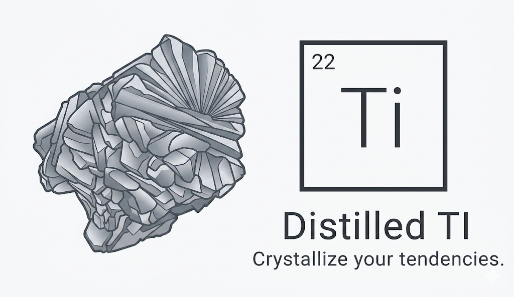
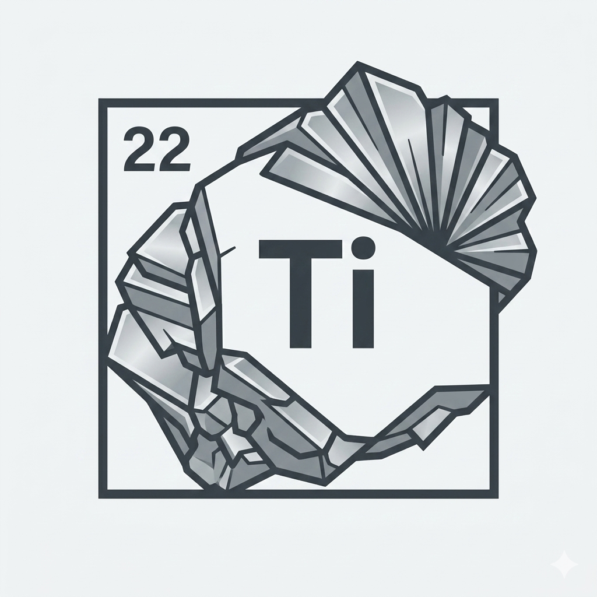

# Distilled TI

> Not a type. A structure.

Distilled TI 是一个面向本地实验与原型验证的「连续人格 / 行为倾向估计」项目。  
它不把用户压缩成一次性的固定分型，而是通过持续答题，在固定核心维度空间中动态更新状态，并生成结构化报告、聚类解释与叙事标签。

## 预览





## 为什么做这个项目

传统人格测试更像一次性贴标签，而 Distilled TI 更接近一个动态画像引擎：

- 输出连续状态，而不是固定类型
- 支持中断、继续、补题，而不是必须一次做完
- 报告允许不确定性存在，不强行制造绝对判断
- 标签只是解释层，不是测量本体
- 核心骨架固定，细节通过子维度和模块逐步展开

## 功能总览

| 模块 | 当前状态 | 说明 |
| --- | --- | --- |
| 匿名会话启动 | 已完成 | 返回 `session_id`、`session_secret`、`delete_token` |
| 连续答题调度 | 已完成 | 根据当前状态动态选择下一题 |
| 正式报告生成 | 已完成 | 达到 `20` 题后可生成报告 |
| 二维投影地图 | 已完成 | 展示当前位置、轨迹与簇中心 |
| 本地历史恢复 | 已完成 | 可重新签发访问凭证继续答题或看报告 |
| 本地管理端 | 已完成 | 支持 AI 配置、模板管理、聚类概览 |
| 题目改写预览 | 已完成 | 管理端可做受限改写预览 |
| 生产级部署 | 未完成 | 当前仍以本地开发 / 原型验证为主 |

## 截图与界面说明

当前仓库已经包含项目视觉素材，适合作为 GitHub 首页展示：

- `figure/1.png`
  - 主视觉横幅，适合做 README 顶部预览图
- `figure/2.png`
  - 品牌标识，适合做补充展示或社媒封面

前端页面结构已经完整跑通，主要页面包括：

| 路由 | 页面 | 说明 |
| --- | --- | --- |
| `/` | Landing | 选择默认投影模式、命名风格并开始会话 |
| `/session` | 连续答题页 | 展示进度、核心信号、剩余题量 |
| `/report` | 当前报告页 | 查看正式报告、聚类结果、投影地图 |
| `/report/[sessionId]` | 历史报告页 | 针对指定历史会话读取报告 |
| `/history` | 本地历史页 | 恢复短期会话并重新签发凭证 |
| `/admin` | 本地管理页 | 配置 AI、管理模板、查看聚类与实例题 |

## 当前实现状态

目前仓库已经具备一条完整的本地闭环：

- 可启动匿名测试会话，并签发独立访问凭证
- 可按当前状态持续调度下一题
- 可在达到 `20` 题后生成正式报告
- 可查看二维投影、聚类结果、结构标签和叙事标签
- 可在本地历史页恢复短期会话
- 可通过独立管理端配置 AI、查看模板、创建模板和预览改写

这已经不是一个只有静态页面的 demo，而是一个能真实跑通的本地全栈原型。

## 技术栈

| 层级 | 技术 |
| --- | --- |
| Frontend | Next.js 16, React 19, TypeScript, TailwindCSS 4 |
| Backend | FastAPI, Pydantic v2, Uvicorn |
| 建模 / 聚类 | scikit-learn |
| 存储 | SQLite |
| 测试 | pytest |

## 架构概览

```text
Browser / Next.js Frontend
        |
        | HTTP
        v
Public FastAPI (8000) --------> Session / Scoring / Report / Map
        |
        +---------------------> Local SQLite

Admin FastAPI (8001) ---------> AI Config / Template Admin / Cluster Overview
        |
        +---------------------> AI Provider (optional)
```

默认端口：

- 前端：`http://127.0.0.1:3000`
- 公共后端：`http://127.0.0.1:8000`
- 管理后端：`http://127.0.0.1:8001`

默认前端 API 基址：

- `NEXT_PUBLIC_API_BASE_URL=http://127.0.0.1:8000/api`
- `NEXT_PUBLIC_ADMIN_API_BASE_URL=http://127.0.0.1:8001/api`

> 管理 API 由后端做本地来源限制，仅允许本机访问（`127.0.0.1` / `::1` / `localhost`）。

## 项目结构

```text
distilled TI/
├─ backend/
│  ├─ app/
│  │  ├─ api/                # 公共/管理路由、请求模型、安全辅助
│  │  ├─ core/               # 全局配置
│  │  ├─ domain/             # 维度与题库领域模型
│  │  ├─ services/           # 会话、评分、生成、报告、聚类、存储等
│  │  ├─ main.py             # Public API 入口 (8000)
│  │  └─ admin_main.py       # Admin API 入口 (8001)
│  ├─ tests/                 # 后端测试
│  └─ pyproject.toml
├─ frontend/
│  ├─ app/                   # Next.js App Router 页面
│  ├─ components/            # 页面核心交互组件
│  ├─ lib/                   # API 封装、运行时状态存取
│  └─ package.json
├─ docs/
│  ├─ dimensions.md
│  └─ plans/
├─ figure/
├─ Distilled_TI_Architecture_v1.md
├─ item_bank_rewrite_v1.md
├─ start-dev.bat             # Windows 一键启动
└─ start-dev.ps1             # 启动脚本（前后端三进程）
```

## 快速开始

### 环境要求

- Python `>=3.13`
- Node.js `>=20`
- npm `>=10`
- Windows PowerShell

### 安装依赖

后端：

```powershell
cd backend
python -m venv .venv
.venv\Scripts\Activate.ps1
python -m pip install -U pip
python -m pip install -e .[dev]
```

前端：

```powershell
cd frontend
npm install
```

### 一键启动

在仓库根目录执行：

```powershell
.\start-dev.bat
```

脚本会自动启动：

- Public API（`8000`）
- Admin API（`8001`）
- Frontend（`3000`）

### 手动启动

Public API：

```powershell
cd backend
python -m uvicorn app.main:app --reload --host 127.0.0.1 --port 8000
```

Admin API：

```powershell
cd backend
python -m uvicorn app.admin_main:app --reload --host 127.0.0.1 --port 8001
```

Frontend：

```powershell
cd frontend
npm run dev
```

## 构建指南

如果你准备把这个项目从“本地开发”切到“可分发 / 可部署”状态，建议至少完成下面两部分构建。

### 前端构建

在 `frontend` 目录执行：

```powershell
cd frontend
npm install
npm run build
```

构建成功后可用下面命令本地以生产模式启动：

```powershell
npm run start
```

默认仍监听在：

- `http://127.0.0.1:3000`

### 后端生产启动

后端当前不需要前端那种“编译产物”，更接近 Python 服务部署。  
开发时用的是 `--reload`，生产启动建议改为不带热重载：

Public API：

```powershell
cd backend
python -m uvicorn app.main:app --host 127.0.0.1 --port 8000
```

Admin API：

```powershell
cd backend
python -m uvicorn app.admin_main:app --host 127.0.0.1 --port 8001
```

### 后端打包为分发产物

如果你想把后端打成标准 Python 包，可以在 `backend` 目录执行：

```powershell
cd backend
python -m pip install build
python -m build
```

成功后通常会在 `backend/dist/` 下得到：

- `*.whl`
- `*.tar.gz`

### 构建前检查

建议在构建前至少确认：

- 前端依赖已安装完成
- 后端虚拟环境可正常导入 `fastapi`、`uvicorn`、`scikit-learn`
- 本地管理端和公共端口没有被占用
- 不要把本地 `SQLite` 数据库、缓存目录和 `.env` 类文件一起打包上传

### 当前阶段说明

这个仓库现在已经具备：

- 前端可正式执行 `npm run build`
- 后端可正式作为 Python 服务启动
- 后端可通过 `python -m build` 打包

但它还没有完整覆盖：

- Docker 镜像构建
- CI 自动构建与发布
- 线上环境变量模板
- 反向代理、HTTPS、进程守护等生产部署说明

## 使用流程

建议首次体验顺序如下：

1. 启动三端服务
2. 打开首页 `http://127.0.0.1:3000`
3. 进入 `/session` 开始答题
4. 连续答到 `20` 题，生成正式报告
5. 进入 `/report` 查看聚类、结构标签、叙事标签和二维投影
6. 打开 `/history` 查看本地短期历史
7. 打开 `/admin` 配置 AI、查看题库模板和改写预览

## 环境变量

前端支持以下可选环境变量：

| 变量名 | 默认值 | 说明 |
| --- | --- | --- |
| `NEXT_PUBLIC_API_BASE_URL` | `http://127.0.0.1:8000/api` | 公共后端 API |
| `NEXT_PUBLIC_ADMIN_API_BASE_URL` | `http://127.0.0.1:8001/api` | 管理后端 API |

当前后端主要使用代码内配置，核心参数定义在 `backend/app/core/config.py`，例如：

- `session_ttl_hours=1`
- `min_questions_for_report=20`
- `max_questions_per_session=10000`
- `cluster_count=4`
- `local_db_path=distilled_ti_local.db`

## 核心机制

### 会话访问控制

- 启动会话后返回 `session_id`
- 返回 `session_secret`，用于读取会话与提交答案
- 返回 `delete_token`，用于主动销毁会话
- 会话访问绑定请求指纹，避免凭证被简单复制后跨环境读取

### 渐进式答题

- 前期优先建立核心画像
- 达到 `20` 题后允许先出报告
- 后续仍可继续补题，细化子维度和模块画像

### 本地管理端

- 管理 API 与普通用户入口分离
- 管理端只允许本机访问
- 前端普通入口不直接持久化 API Key

### 报告生成

- 输出结构标签、叙事标签、核心条形图、子维度条形图、模块条形图
- 输出聚类名称、混合权重、聚类置信度
- 输出二维投影点位与轨迹
- 若 AI 未配置或调用失败，回退到后端 deterministic 文案

## 维度体系

当前维度设计见 `docs/dimensions.md`，现阶段包括：

- `10` 个核心维度
- 若干 seed subdimensions
- 若干 projection modules

设计思路不是“无限加新维度”，而是固定核心骨架，再逐渐展开更细的子维度与场景模块。

## API 概览

### Public API

- `POST /api/session/start`
- `POST /api/question/next`
- `POST /api/response/submit`
- `GET /api/session/{session_id}/summary`
- `GET /api/session/{session_id}/report`
- `POST /api/session/{session_id}/report`
- `GET /api/session/{session_id}/map`
- `DELETE /api/session/{session_id}`

### Admin API

- `POST /api/session/{session_id}/access`
- `POST /api/ai/config`
- `GET /api/ai/config`
- `POST /api/ai/rewrite-question`
- `GET /api/admin/templates`
- `POST /api/admin/item-template/create`
- `PUT /api/admin/item-template/{template_id}`
- `POST /api/admin/item-template/{template_id}/archive`
- `DELETE /api/admin/item-template/{template_id}`
- `GET /api/admin/item-instances`
- `GET /api/admin/sessions`
- `POST /api/admin/cleanup`
- `GET /api/admin/clusters/overview`
- `POST /api/admin/clusters/label-override`

## 数据与本地存储

当前版本主要使用本地 SQLite，数据库主要承载：

- 活跃会话与短期历史
- 题目实例
- 聚类相关结果
- 管理端读取所需的本地状态

这意味着当前仓库更偏向本机开发 / 原型验证，而不是生产级多用户部署。

## 安全与公开仓库检查

当前仓库发布前已做过一轮检查：

- 已忽略本地数据库文件
- 已忽略 `__pycache__`、`.pytest_cache`、`.pip-audit-cache`、`node_modules`、`.next`
- 未发现真实 `.env` 文件
- 未发现明显真实 API key / token 字串
- 仅存在测试中的占位值 `secret-key`

## 测试

在 `backend` 目录执行：

```powershell
pytest
```

当前测试覆盖：

- 健康检查
- 会话 API
- 管理 API
- 评分与聚类
- 题库与生成相关逻辑

## 开发路线图

### 已完成

- 基础前后端闭环
- 匿名会话与访问凭证
- 连续答题与报告生成
- 二维投影与聚类展示
- 本地管理页与模板管理
- AI 配置与受限改写预览

### 下一步

- 增加真实页面截图而不仅是品牌视觉素材
- 将后端配置迁移到环境变量体系
- 将本地 SQLite 抽象成可替换存储层
- 增加更多题库审查与统计分析工具
- 补充 CI、lint、自动化测试和发布流程
- 设计更适合线上部署的权限与持久化方案

## 已知限制

- 当前默认偏向本地运行，尚未整理成生产部署方案
- 后端配置仍主要写在代码里，不是完整环境变量化
- 数据库存储是本地 SQLite，不适合直接扩展为多人生产服务
- 当前 README 截图区使用的是项目现有品牌视觉素材，不是运行时页面截图

## 文档入口

- `docs/plans/2026-04-13-embedding-vector-layer-adr.md`
- `docs/development-guide.md`
- `docs/dimensions.md`
- `Distilled_TI_Architecture_v1.md`
- `item_bank_rewrite_v1.md`
- `backend/README.md`
- `frontend/README.md`

## 免责声明

本项目当前定位为娱乐与结构化自测工具，不构成临床诊断、医疗建议或高风险场景决策依据。
